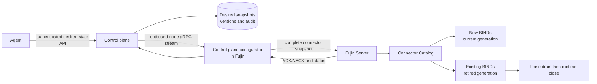

# Runtime Control Plane for Connector Configuration

## Goal

Make Fujin’s connector topology runtime-configurable by an authorized control plane without restarting the Fujin process or changing the connector generation of an already bound session.

The first delivery lets a control plane publish a complete, versioned connector snapshot to a Fujin node. Fujin validates and atomically publishes that snapshot for new `BIND` operations, reports acceptance or rejection, and retires the prior generation only after its existing session leases are released.

This is an xDS-like architecture, not an implementation of Envoy’s xDS resource model or protocol.

## Existing foundation

The relevant lifecycle already exists:

```text
CompileGeneration(config)
→ Catalog.Reload(config)
→ atomic generation publication
→ existing BIND remains pinned to its acquired generation
→ retired generation closes after its final Binding.Close()
```

- `public/plugins/connector/catalog.go` owns immutable connector generations, publication, retirement, leases, and runtime cleanup.
- `public/server/server.go:ReloadConnectors()` is the server-level apply operation.
- `public/plugins/configurator` currently supplies startup configuration only through `Configurator.Load()`.
- `public/service/service.go` calls `Load()` before constructing the `Server`; it does not retain or observe the configurator after startup.

The implementation must reuse this generation model. It must not migrate an active `Core` to a different connector generation.

## Scope

### In scope: first release

- A control-plane-backed configurator that receives a complete, versioned **connector** snapshot during runtime.
- A bidirectional outbound gRPC stream initiated by Fujin to the control plane.
- Acknowledge or reject each snapshot after Fujin has tried to apply it.
- Per-snapshot and per-connector lifecycle status reporting.
- Node identity, mTLS transport authentication, authorization of the node’s assigned desired state, audit records in the control plane.
- A small authenticated agent/control-plane API that changes desired connector state; agents never connect directly to Fujin data-plane instances.
- Full-snapshot (state-of-the-world) reconciliation only.

### Explicitly out of scope

- Envoy xDS protocol compatibility, ADS, LDS/RDS/CDS/EDS/SDS resource types, or Delta xDS.
- Runtime loading or unloading arbitrary Go packages.
- Updating connector types that are absent from the currently running binary.
- Migrating existing `BIND`, transactions, readers, writers, subscriptions, or settlement state between generations.
- Runtime reconciliation of transports, gRPC listeners, health listener, logging bootstrap, or the control-plane bootstrap address.
- Broker reachability as an apply prerequisite. Connector configuration remains side-effect-free to compile; broker I/O stays lazy and belongs to the first operation that needs it.
- Offline desired-state caching or start-from-last-known-good configuration. In the first release, a control-plane configurator fails startup if it cannot obtain a valid initial snapshot.

## Non-negotiable invariants

1. **A successful BIND is immutable with respect to connector generation.** A session keeps the generation acquired during BIND until `Core.Close()` releases it.
2. **Validation precedes publication.** A malformed snapshot changes no active connector configuration.
3. **Updates are atomic at the connector-catalog boundary.** A node never exposes a partial connector snapshot to new BIND requests.
4. **Removal drains.** Removing a connector from a later snapshot prevents new BINDs after publication, but existing sessions remain usable through the retired generation.
5. **Last known good remains live.** A NACK leaves the node’s active connector generation untouched.
6. **Fujin initiates control-plane connectivity.** The node opens an outbound, mutually authenticated stream. The control plane does not require inbound reachability to Fujin.
7. **Configuration and readiness are distinct.** `ACK` means the snapshot was accepted and published for new BINDs. Broker connectivity/readiness is reported independently.
8. **No raw agent authority reaches a node.** The agent writes desired state to the control plane; the control plane authenticates, authorizes, stores, audits, and delivers it.

## Target architecture



Responsibilities:

| Layer | Responsibility |
|---|---|
| Control plane | Stores desired state; authenticates/authorizes agent writes; selects the snapshot assigned to each node; retains audit history; sends updates; records node results. |
| Control-plane configurator | Gets the bootstrap endpoint/identity; connects outward; receives snapshots; hands them to the running Fujin process; returns acknowledgements and status. |
| `service` | Starts the runtime watch only after `Server` has started successfully; serializes apply calls; coordinates watcher shutdown. |
| `server` | Applies the supported runtime scope, initially connector snapshots only. |
| `connector.Catalog` | Compiles, atomically publishes, retires old generations, and closes resources after final leases. |

## Protocol model

Use one Fujin-specific bidirectional gRPC `Sync` stream in the first release. It carries a state-of-the-world connector snapshot, not individual mutations.

```text
Fujin → Hello(node ID, build version, active snapshot version, connector types compiled into binary)
Control plane → Snapshot(version, full connector configuration)
Fujin → ApplyResult(version, ACK | NACK, diagnostics)
Fujin → ComponentStatus(version, connector, ACCEPTED | READY | DRAINING | RETIRED | FAILED)
```

### Snapshot rules

- `version` is opaque, strictly ordered per node assignment, and idempotent.
- A snapshot is the complete desired connector map for its target Fujin node or tenant partition.
- A connector absent from snapshot `N+1` is removed from the desired state.
- Re-delivering the already active version is an ACK-only no-op.
- A delayed version older than the last accepted version is ignored and reported as stale; it must not roll the node backward.
- If the stream reconnects, Fujin sends its current accepted version in `Hello`; the control plane returns the newest assigned full snapshot.

### Apply result semantics

| Result | Meaning |
|---|---|
| `ACK` | `CompileGeneration()` and `Catalog.Reload()` succeeded; the snapshot is published for new BINDs. |
| `NACK` | The snapshot could not be compiled or validated; the previous catalog remains current. Diagnostics identify connector and validation failure. |
| `READY` | A component is usable according to a defined readiness probe. This is separate from `ACK`; no generic broker probe is introduced in the first release. |
| `DRAINING` | A prior generation is retired but has leases. |
| `RETIRED` | The retired generation’s final lease was released and its runtime cleanup completed. |
| `FAILED` | A component/runtime readiness attempt failed after acceptance. |

The first release can report only `ACK`, `NACK`, and aggregate generation `DRAINING`/`RETIRED`. Per-connector readiness should be added only when a connector-level readiness contract is designed consistently across adapters.

## Configurator extension

Keep the current startup contract unchanged:

```go
type Configurator interface {
    Load(ctx context.Context, cfg any) error
}
```

Add an optional runtime capability, not an endless loop inside `Load()`:

```go
// ConnectorSnapshot is immutable desired connector state from a runtime source.
type ConnectorSnapshot struct {
    Version    string
    Connectors connectorconfig.ConnectorsConfig
}

type ApplyState uint8

const (
    ApplyAccepted ApplyState = iota
    ApplyRejected
    ApplyStale
)

type ApplyResult struct {
    Version string
    State   ApplyState
    Error   error
}

// ConnectorWatcher is implemented by configurators that can supply runtime
// connector snapshots. Watch blocks until ctx cancellation or terminal source failure.
type ConnectorWatcher interface {
    WatchConnectors(ctx context.Context, apply func(context.Context, ConnectorSnapshot) ApplyResult) error
}
```

A configurator may implement both `Configurator` and `ConnectorWatcher`. `service` obtains the configured instance once, calls `Load()` for bootstrap, creates the server, and only then starts `WatchConnectors()` when supported.

This first interface deliberately names connectors. A generic `Watch(any)` would erase the schema boundary and invite a partially supported runtime update of transports, listeners, and bootstrap fields.

### Bootstrap for the control-plane configurator

The control-plane configurator itself is selected with `FUJIN_CONFIGURATOR=control-plane`. Its connection settings come only from immutable process bootstrap inputs, initially environment variables:

```text
FUJIN_CONTROL_PLANE_ADDRESS
FUJIN_CONTROL_PLANE_NODE_ID
FUJIN_CONTROL_PLANE_TLS_CA_FILE
FUJIN_CONTROL_PLANE_TLS_CERT_FILE
FUJIN_CONTROL_PLANE_TLS_KEY_FILE
```

`Load()` connects, fetches the initial full configuration snapshot, and populates `service.Config` for normal startup. `WatchConnectors()` then retains the same authenticated stream or reconnects with exponential backoff and watches later snapshots.

Do not permit a delivered snapshot to change its own control-plane endpoint, node identity, or trust roots.

## Implementation phases

### Phase 1 — establish the runtime source seam

1. Add `ConnectorSnapshot`, `ApplyState`, `ApplyResult`, and optional `ConnectorWatcher` to `public/plugins/configurator`.
2. Refactor `service.loadConfigWithLoader()` so it returns the constructed configurator instance together with the loaded configuration; do not construct it twice.
3. After `server.NewServer()` succeeds, detect `ConnectorWatcher` and run it under the server lifecycle context.
4. Serialize snapshot application in `service`; no two calls to `Server.ReloadConnectors()` may overlap.
5. Apply each accepted snapshot through the existing `Server.ReloadConnectors(snapshot.Connectors)` path.
6. Add a fake watcher configurator in tests to cover accepted, rejected, repeated, stale, and shutdown behavior.

**Acceptance:** a test configurator can publish a connector snapshot after startup; new BINDs use it while a BIND created before the update retains its original generation.

### Phase 2 — make versioning and results observable

1. Add a server-owned runtime configuration status object: active connector snapshot version, latest rejected version/diagnostic, and retired generation drain status.
2. Make `ReloadConnectors` return a structured result rather than only `error`, without weakening the existing public behavior unexpectedly.
3. Reject stale versions before calling `Catalog.Reload()`.
4. Guarantee duplicate accepted snapshots are no-op ACKs.
5. Export metrics/log fields for snapshot version, apply duration, accepted/rejected count, active generation, and draining generations.

**Acceptance:** tests prove that invalid `N+1` leaves `N` current, replays of `N` do not create a generation, and stale `N-1` cannot roll back `N`.

### Phase 3 — define and implement the control-plane protocol

1. Add a protobuf package and generated Go code for the Fujin-specific `Sync` stream.
2. Define `Hello`, `ConnectorSnapshot`, `ApplyResult`, and `ComponentStatus` messages with explicit protocol version fields.
3. Implement a `control-plane` configurator that performs mTLS client authentication and opens the outbound stream.
4. Implement reconnects with bounded exponential backoff, preserving the last accepted version across reconnects.
5. Ensure the control plane retransmits the latest full snapshot after reconnect; do not invent per-resource delta semantics.
6. Validate that snapshot connector types are in `connector.List()` before attempting publication, and return a diagnostic naming unsupported types.

**Acceptance:** an integration test runs a test control plane, starts Fujin using the control-plane configurator, receives an initial snapshot, applies a newer valid snapshot, NACKs an invalid one, disconnects/reconnects, and resumes from the active version.

### Phase 4 — build the control-plane service and agent API

1. Persist desired connector snapshots, node assignments, version history, agent identity, authorization decision, timestamp, reason, and content digest.
2. Expose an authenticated desired-state API. Start with full-snapshot replacement for an assigned node/tenant:

   ```text
   PUT /v1/nodes/{node}/connector-snapshot
   GET /v1/nodes/{node}/connector-snapshot
   GET /v1/nodes/{node}/status
   ```

3. Use optimistic concurrency (`If-Match`/previous version) to prevent two agents from silently overwriting each other.
4. Audit every accepted and rejected desired-state write, and every node ACK/NACK.
5. Authorize changes at the narrowest practical scope: node/tenant, connector name, allowed connector type, permitted broker endpoint/credential reference.
6. Do not put raw broker credentials in agent-provided snapshots; reference a separately managed secret identity.

**Acceptance:** an authorized agent updates a node snapshot and receives final node apply status; an unauthorized or conflicting request changes no desired state; audit records identify actor, previous version, new version, and node result.

### Phase 5 — operational hardening

1. Add `/debug` or admin-only status exposing configured version, active version, last rejection, stream connection state, and drain counts.
2. Add bounded update queues/coalescing: while a node is applying version `N`, retain only the newest later full snapshot; never apply snapshots concurrently.
3. Define control-plane unavailability behavior: existing active configuration continues indefinitely; startup behavior remains fail-closed in this release.
4. Add alerts for prolonged disconnection, repeated NACKs, and generations stuck draining.
5. Document operator recovery: inspect NACK, correct desired state, publish next version; never mutate a node’s catalog out of band.

**Acceptance:** sustained update bursts converge each node to the newest valid snapshot without concurrent applies or leaked retired generations.

## Testing matrix

| Scenario | Expected result |
|---|---|
| Valid initial snapshot | Server starts; current catalog matches the snapshot. |
| Valid runtime replacement | New BINDs acquire the replacement generation. |
| Existing bound session during replacement | It keeps its original generation until `Close()`. |
| Connector removed from snapshot | New BIND fails for that name; old sessions continue; old runtime closes after final lease. |
| Invalid snapshot | NACK; prior catalog pointer remains current. |
| Duplicate version | ACK/no-op; no extra generation. |
| Stale version | Stale result/no-op; no rollback. |
| Control-plane disconnect | Current data plane continues; watcher reconnects. |
| Process shutdown | Watcher exits with context; stream closes; normal catalog cleanup executes. |
| Unsupported connector type | NACK before publication, with explicit type diagnostic. |
| Concurrent source messages | Applies are serialized; final active state is latest accepted complete snapshot. |

## Design decisions deferred until a real requirement

- Delta/per-resource configuration updates.
- Multi-resource transactions across connectors, transports, TLS, middleware, and listeners.
- Generic connector readiness probes and their exact broker-specific semantics.
- Desired-state cache allowing offline startup.
- Tenant routing and whether each node receives a whole-server or tenant-partitioned snapshot.
- Sandbox/WASM or external worker extensions.
- Envoy xDS compatibility adapter.

## Definition of done for the first release

A Fujin node configured with the control-plane configurator starts from a valid remote connector snapshot, keeps an outbound mTLS stream to the control plane, safely applies a later complete connector snapshot through the existing catalog generation mechanism, and reports ACK/NACK plus drain status. New BINDs see the accepted snapshot; existing sessions remain pinned to their original generation; invalid and stale snapshots do not change live traffic.
