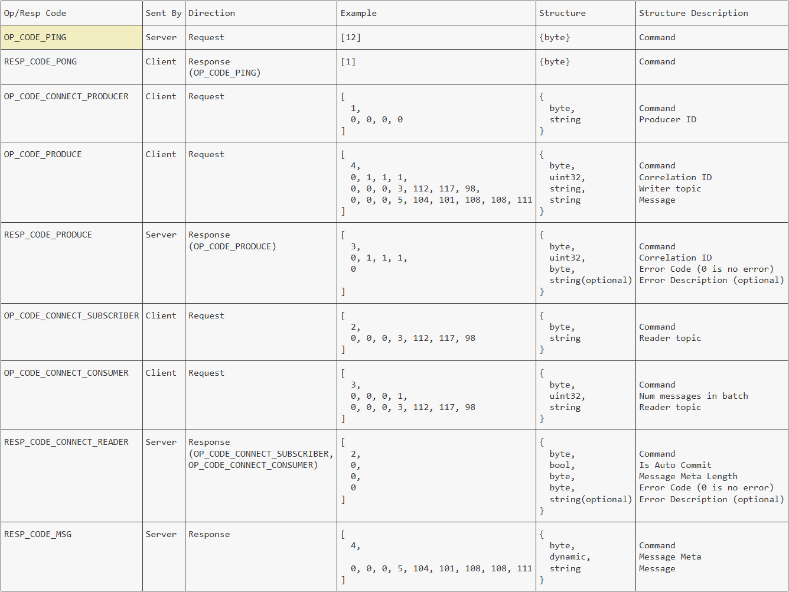

# Fujin protocol

Here you can find a brief description of native Fujin protocol, that is used to communicate between the Fujin server and client. It is a byte-based, publish/subscribe protocol. Fujin server is actually a QUIC server.

The Fujin server implements a [zero allocation byte parser](https://youtu.be/ylRKac5kSOk?t=10m46s), inspired by the NATS server, that is fast and efficient.

## Protocol conventions

**Command Array of Bytes with Optional Content**: Each interaction between the client and server consists of a control, or protocol, array of bytes followed, optionally by message content.
**No Command Delimiters**: The Fujin server recieves Commands as a plain stream of bytes. Commands are splitted based on its structure.
**Byte Order**: The Fujin server uses Big Endian byte order.

## Types

Before we can move to Commands description, we should explore types, that are being utilized by the Fujin protocol.

| Type   | Length                                           | Example         |
|--------|--------------------------------------------------|-----------------|
| byte   | 1                                                | [12]            |
| uint32 | 4                                                | [0, 0, 0, 0]    |
| string | Dynamic. String length (int32) + payload (bytes) | [0, 0, 0, 1, 1] |
| bool   | 1                                                | [0]             |

## Protocol messages
